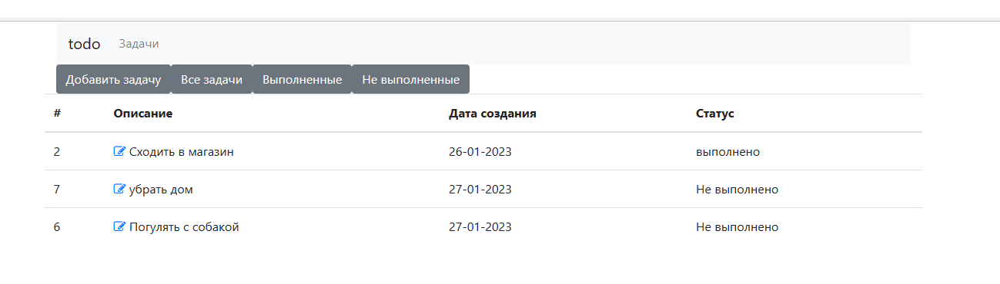
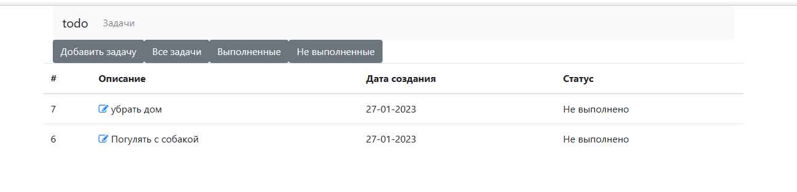
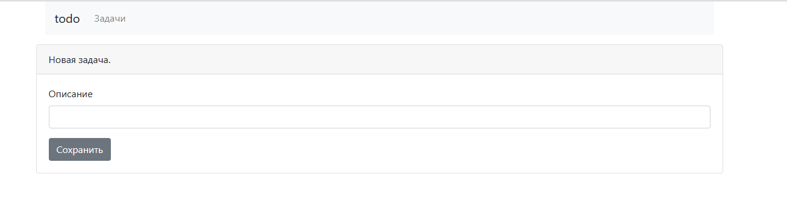
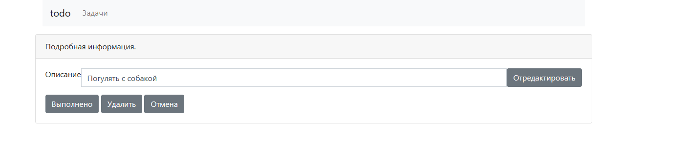

# job4j_todo
Проект "job4j_todo"

Данное приложение разработано для хранения списка задач.

Стек технологий: Spring boot, Thymeleaf, Bootstrap, Hibernate 5.

Требования к окружению: Java 17, Maven, PostgresSql 14.

Приложение оболадает несколькими удобными функциями:

1. Отображается текущий статус задачи - "Выполнено/Не выполнено".

2. Реализован удобный отбор задач по статусу "Все/Выполнено/Не выполнено".

3. Форма создания задачи.

4.Есть отдельная форма для внесения изменеий в созданную задачу. 
Доступные команды - отредактировать, выполнить, удалить. Также есть возможнсть вернутся к списку без изменеий в задаче.

Контакты:
- email   avetis.mkhitaryants@gmail.com
- телеграм @avetis_m
